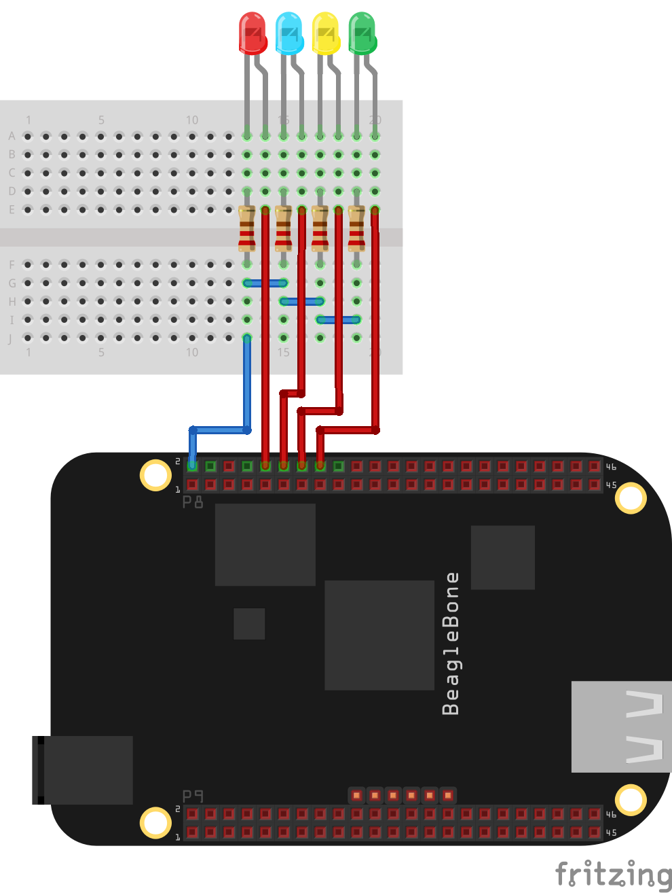
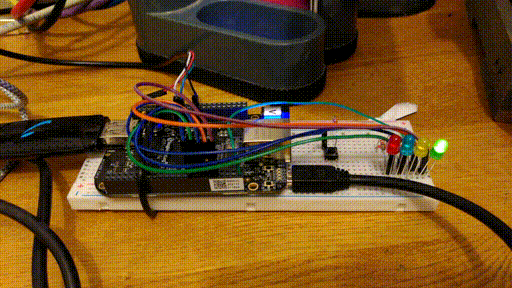

# led flash demo

This is a sample project who demostrate how to make blink 4 leds
connected to the GPIOS of a Beagle Bone black board.

I integrate the shematic about how to wire the leds.

I use 320 ohms resistors but according with Tom Jones who inspires me this
sample, anything between 200 and 400 ohms will be fine.

ledflash.c is the C code turning on and off the leds, you can compile it using make
in the Beagle Bone with only base tools.

demo.sh is a shell script doing the GPIOS setup and running the demo.
Of course the setup can be done in C at the befining of the code.

